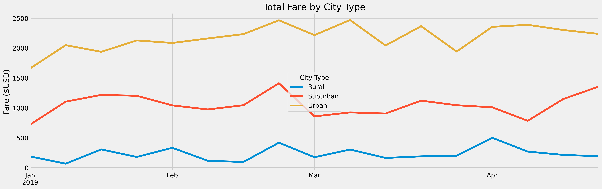

# PyBer_Analysis

## Overview of the Analysis:
- The purpose of this analysis is to show the relationship of fares as it relates to average by ride, driver and city type.
- The fist step was to use the groupby() function to find the count of riders, sum of drivers, and sum of the fares to be able to calculate the average fare by rides and drivers.
- Next we formatted the data and put it into a new dataframe:

 

## Results:
### Ride-Sharing Data among City Types:
- Urban
    - asdf

 

- Suburban
    - asdf

 

- Rural
    - asdf

 

<table>
  <tr>
    <td></td>
  </tr>
 </table>

 

 

## Summary:
